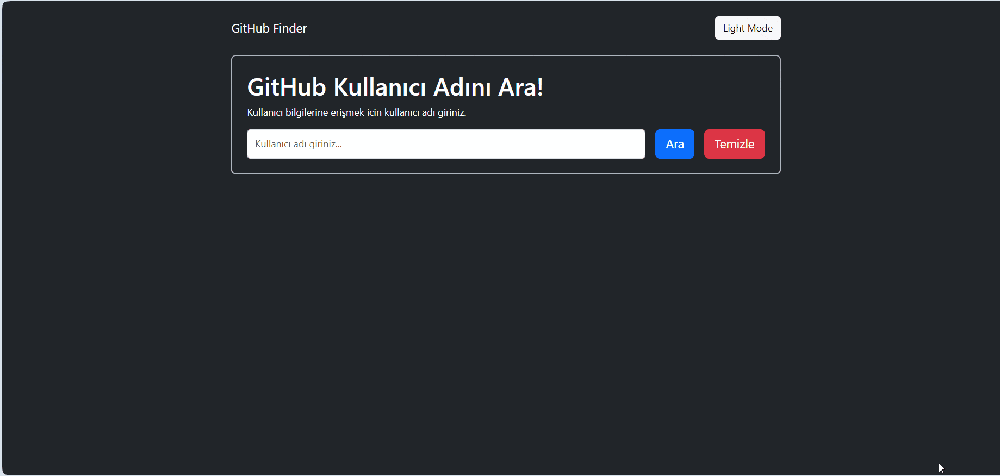

<h1>GitHub Finder</h1>

GitHub Finder is a web application that allows you to quickly and effectively find user profiles and repositories on GitHub.

<h2>Technologies used in the project</h2>

Codded in HTML5 , CSS3 and JS

<h2>Screen Gif</h2>

